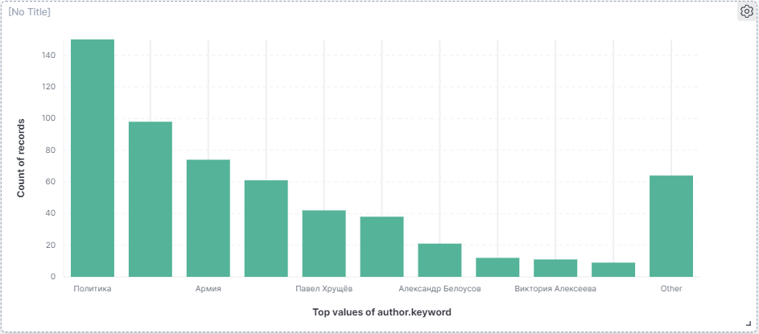
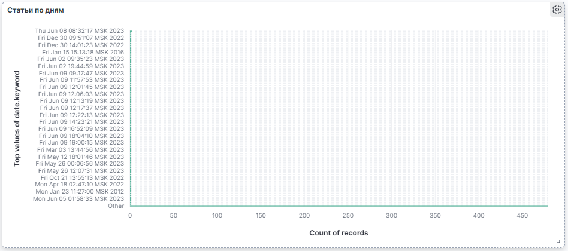

# Дашборды
## Топ по авторам/темам 

```
{
  "aggs": {
    "0": {
      "terms": {
        "field": "author.keyword",
        "order": {
          "_count": "desc"
        },
        "size": 10
      }
    }
  },
  "size": 0,
  "script_fields": {},
  "stored_fields": [
    "*"
  ],
  "runtime_mappings": {},
  "query": {
    "bool": {
      "must": [],
      "filter": [],
      "should": [],
      "must_not": []
    }
  }
}
```

## Cтатьи по дням

```
{
  "aggs": {
    "0": {
      "terms": {
        "field": "date.keyword",
        "order": {
          "_count": "desc"
        },
        "size": 100
      }
    }
  },
  "size": 0,
  "script_fields": {},
  "stored_fields": [
    "*"
  ],
  "runtime_mappings": {},
  "query": {
    "bool": {
      "must": [],
      "filter": [],
      "should": [],
      "must_not": []
    }
  }
}
```

# Поиск похожих статей
Для поиска похожих статей используется связка Shingles + MinHash.

Длина шинглов 5 символов.

Метод findSimilarDocuments ShingleFinder позволяет производить поиск таких статей, параметр numberOfCommonElements определяет, насколько "похожими" должны быть статьи.